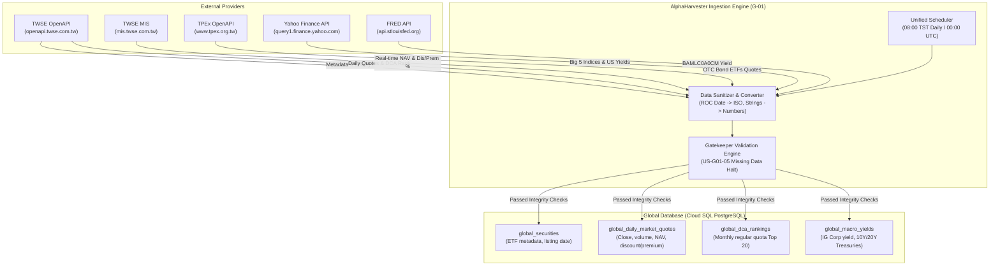

# AlphaHarvester External Interface Specifications (External Specs)

> **Document Version**: v1.0.0  
> **Last Updated**: 2026-09-22  
> **Traceability**: [PRD-AlphaHarvester.md](../PRD/PRD-AlphaHarvester.md) §2.1, [US-G01-market-data-ingestion.md](../user-stories/US-G01-market-data-ingestion.md), [US-G02-global-universe-ranking.md](../user-stories/US-G02-global-universe-ranking.md), [US-G03-global-macro-yield.md](../user-stories/US-G03-global-macro-yield.md)

---

## 1. Executive Summary & Verification Status

AlphaHarvester relies on automated ingestion of external financial market data to drive:
1. **Global Layer Screening & Factor Ranking** (Central Limit Theorem $N \ge 30$ trading days, $R^2 \ge 0.95$, TER, Discount/Premium, DCA Top 20).
2. **Macro Yield State Machine** (US Investment Grade Corporate Bond Yield vs 10Y/20Y US Treasuries).
3. **Personal Portfolio Valuation & Calibrations** (NAV, daily close, dividends, volume).

All upstream data providers and endpoints specified in this directory have been **empirically verified via live network probes on 2026-09-22**.

### Empirical Probe Verification Summary

| Provider | Data Domain | Endpoint / API | Live Probe Result | Sample Records |
| :--- | :--- | :--- | :--- | :--- |
| **TWSE OpenAPI** | ETF Static Metadata & Listing Date | `GET /opendata/t187ap47_L` | **HTTP 200 (Verified)** | 271 active fund records (e.g. 0050, 00400A) |
| **TWSE OpenAPI** | Concentrated Market Daily Quotes | `GET /exchangeReport/STOCK_DAY_ALL` | **HTTP 200 (Verified)** | 1,380 securities (240+ TWSE ETFs) |
| **TPEx OpenAPI** | OTC Market Daily Quotes (Bond ETFs) | `GET /openapi/v1/tpex_mainboard_quotes` | **HTTP 200 (Verified)** | 1,017 securities (118 TPEx ETFs, e.g. 00679B) |
| **TWSE MIS** | Real-time NAV & Discount/Premium | `GET /stock/data/all_etf.txt` | **HTTP 200 (Verified)** | 358 ETFs with exact NAV, market price, % discount |
| **TWSE OpenAPI** | Monthly Regular Quota (定期定額) Top 20 | `GET /ETFReport/ETFRank` | **HTTP 200 (Verified)** | 20 ranked ETFs (Top 1: 0050, 1.28M accounts) |
| **Yahoo Finance** | Global Big 5 Benchmark Indices | `GET /v8/finance/chart/{symbol}` | **HTTP 200 (Verified)** | `^TWII`, `^GSPC`, `^NDX`, `^SOX`, `^N225` |
| **Yahoo Finance** | Macro US Treasury Yields | `GET /v8/finance/chart/{symbol}` | **HTTP 200 (Verified)** | `^TNX` (10Y: 4.96%), `^TYX` (30Y: 5.29%), `LQD` |
| **U.S. Treasury** | Daily Yield Curve (Zero-Key Default) | `GET /resource-center/.../xml` | **HTTP 200 (Verified)** | Official 10Y: 4.96%, 20Y: 5.33%, 30Y: 5.29% (No API Key required) |
| **FRED API** | US IG Corporate Yield & Spreads | `GET /fred/series/observations` | **HTTP 200 (Spec defined)** | Official API (Optional Key) with zero-key fallback |

---

## 2. Specification Directory Structure

```text
docs/01-requirements/external-specs/
├── README.md                              # This master index & verification report
├── spec-twse-tpex-market-data.md          # TWSE & TPEx OpenAPI + MIS endpoints (ETFs, daily quotes, NAV, DCA)
├── spec-yahoo-finance-benchmarks.md       # Yahoo Finance Chart API (Big 5 indices, historical bars, yields)
├── spec-fred-macro-yield.md               # FRED API & Yahoo Yield fallback (BAMLC0A0CM, 10Y/20Y Treasuries)
└── samples/                               # [Executable Reference Implementation]
    ├── README.md                          # Sample usage guide & execution snapshot
    └── verify_external_feeds.py           # Standalone zero-dependency Python probe & validation script
```

---

## 3. Ingestion Architecture & Data Flow



---

## 4. Cross-System Resilience & Error Policy

1. **Gatekeeper Halt Trigger (US-G01-05)**:
   - If TWSE or Yahoo Finance feeds are unreachable or contain corrupted records, the calculation engine **must immediately halt** and flag the affected date as incomplete.
   - Partial updates are prohibited from triggering downstream ranking (G-02) or personal rebalancing orders (P-02).
2. **ROC Year Normalization**:
   - Taiwan government sources report dates in Republic of China (ROC) format (e.g. `1150922`).
   - The sanitizer strictly transforms `ROC_Year + 1911` into ISO 8601 strings (`2026-09-22`).
3. **Numeric Sanitization**:
   - Fields containing commas (e.g. `"1,860,540,000"`) or stringified floats (e.g. `"--"`, `"N/A"`) are converted into standard `Decimal` / `BigInt` or mapped to `NULL`.
4. **Primary / Fallback Redundancy**:
   - Market quotes for Core ETFs: TWSE/TPEx OpenAPI is primary; Yahoo Finance (`{symbol}.TW` / `{symbol}.TWO`) is secondary fallback.
   - Macro Yields: FRED API is primary; Yahoo Finance `^TNX` / `^TYX` / `LQD` is secondary fallback.

