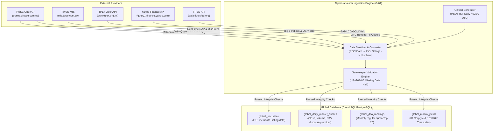
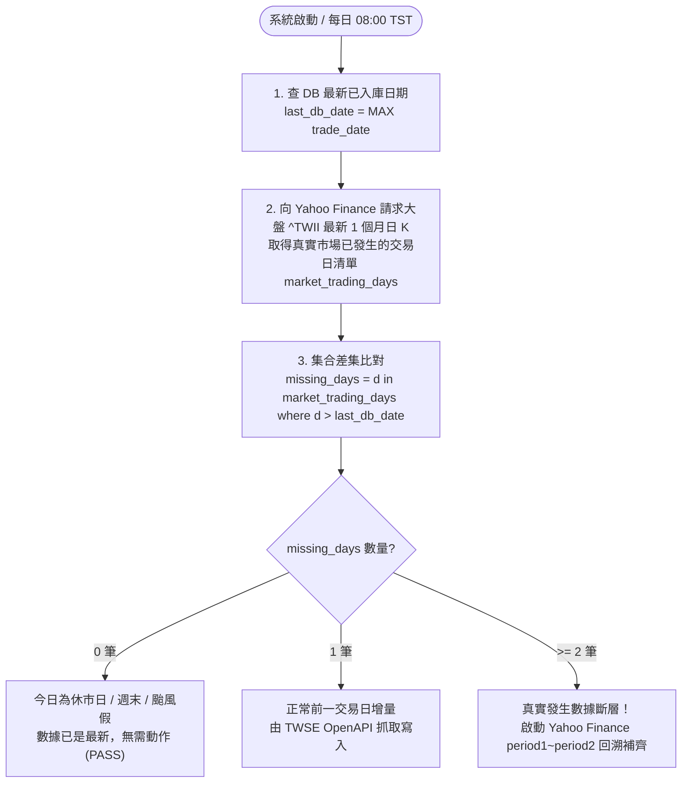

# AlphaHarvester External Interface Specifications (External Specs)

> **Document Version**: v1.0.0  
> **Last Updated**: 2026-09-22  
> **Traceability**: [PRD-AlphaHarvester.md](../PRD/PRD-AlphaHarvester.md) §2.1, [US-G01-market-data-ingestion.md](../user-stories/US-G01-market-data-ingestion.md), [US-G02-global-universe-ranking.md](../user-stories/US-G02-global-universe-ranking.md), [US-G03-global-macro-yield.md](../user-stories/US-G03-global-macro-yield.md)

---

## 1. Executive Summary & Verification Status

AlphaHarvester relies on automated ingestion of external financial market data to drive:
1. **Global Layer Screening & Factor Ranking** (Central Limit Theorem $N \ge 30$ trading days, $R^2 \ge 0.95$, TER, Discount/Premium, DCA Top 20).
2. **Macro Yield State Machine** (US Investment Grade Corporate Bond Yield vs 10Y/20Y US Treasuries).
3. **Personal Portfolio Valuation & Calibrations** (NAV, daily close, dividends, volume).

All upstream data providers and endpoints specified in this directory have been **empirically verified via live network probes on 2026-09-22**.

### Empirical Probe Verification Summary

| Provider | Data Domain | Endpoint / API | Live Probe Result | Sample Records |
| :--- | :--- | :--- | :--- | :--- |
| **TWSE OpenAPI** | ETF Static Metadata & Listing Date | `GET /opendata/t187ap47_L` | **HTTP 200 (Verified)** | 271 active fund records (e.g. 0050, 00400A) |
| **TWSE OpenAPI** | Concentrated Market Daily Quotes | `GET /exchangeReport/STOCK_DAY_ALL` | **HTTP 200 (Verified)** | 1,380 securities (240+ TWSE ETFs) |
| **TPEx OpenAPI** | OTC Market Daily Quotes (Bond ETFs) | `GET /openapi/v1/tpex_mainboard_quotes` | **HTTP 200 (Verified)** | 1,017 securities (118 TPEx ETFs, e.g. 00679B) |
| **TWSE MIS** | Real-time NAV & Discount/Premium | `GET /stock/data/all_etf.txt` | **HTTP 200 (Verified)** | 358 ETFs with exact NAV, market price, % discount |
| **TWSE OpenAPI** | Monthly Regular Quota (定期定額) Top 20 | `GET /ETFReport/ETFRank` | **HTTP 200 (Verified)** | 20 ranked ETFs (Top 1: 0050, 1.28M accounts) |
| **Yahoo Finance** | Global Big 5 Benchmark Indices | `GET /v8/finance/chart/{symbol}` | **HTTP 200 (Verified)** | `^TWII`, `^GSPC`, `^NDX`, `^SOX`, `^N225` |
| **Yahoo Finance** | Macro US Treasury Yields | `GET /v8/finance/chart/{symbol}` | **HTTP 200 (Verified)** | `^TNX` (10Y: 4.96%), `^TYX` (30Y: 5.29%), `LQD` |
| **U.S. Treasury** | Daily Yield Curve (Zero-Key Default) | `GET /resource-center/.../xml` | **HTTP 200 (Verified)** | Official 10Y: 4.96%, 20Y: 5.33%, 30Y: 5.29% (No API Key required) |
| **FRED API** | US IG Corporate Yield & Spreads | `GET /fred/series/observations` | **HTTP 200 (Spec defined)** | Official API (Optional Key) with zero-key fallback |

---

## 2. Specification Directory Structure

```text
docs/01-requirements/external-specs/
├── README.md                              # This master index & verification report
├── spec-twse-tpex-market-data.md          # TWSE & TPEx OpenAPI + MIS endpoints (ETFs, daily quotes, NAV, DCA)
├── spec-yahoo-finance-benchmarks.md       # Yahoo Finance Chart API (Big 5 indices, historical bars, yields)
├── spec-fred-macro-yield.md               # FRED API & Yahoo Yield fallback (BAMLC0A0CM, 10Y/20Y Treasuries)
└── samples/                               # [Executable Reference Implementation]
    ├── README.md                          # Sample usage guide & execution snapshot
    └── verify_external_feeds.py           # Standalone zero-dependency Python probe & validation script
```

---

## 3. Ingestion Architecture & Data Flow



---

## 4. Cross-System Resilience & Error Policy

1. **Gatekeeper Halt Trigger (US-G01-05)**:
   - If TWSE or Yahoo Finance feeds are unreachable or contain corrupted records, the calculation engine **must immediately halt** and flag the affected date as incomplete.
   - Partial updates are prohibited from triggering downstream ranking (G-02) or personal rebalancing orders (P-02).
2. **ROC Year Normalization**:
   - Taiwan government sources report dates in Republic of China (ROC) format (e.g. `1150922`).
   - The sanitizer strictly transforms `ROC_Year + 1911` into ISO 8601 strings (`2026-09-22`).
3. **Numeric Sanitization**:
   - Fields containing commas (e.g. `"1,860,540,000"`) or stringified floats (e.g. `"--"`, `"N/A"`) are converted into standard `Decimal` / `BigInt` or mapped to `NULL`.
4. **Primary / Fallback Redundancy**:
   - Market quotes for Core ETFs: TWSE/TPEx OpenAPI is primary; Yahoo Finance (`{symbol}.TW` / `{symbol}.TWO`) is secondary fallback.
   - Macro Yields: FRED API is primary; Yahoo Finance `^TNX` / `^TYX` / `LQD` is secondary fallback.

---

## 5. Dual-Engine Ingestion Strategy (歷史回填 vs 每日增量 vs 斷線修復)

| 作業情境 | 觸發時機 | 最佳數據引擎 | 技術原因與執行邏輯 |
| :--- | :--- | :--- | :--- |
| **系統冷啟動初始化 (Seed Backfill)** | 系統首次建置或納入新標的 (一次性) | **Yahoo Finance** (`range=2y`) | 證交所 OpenAPI `STOCK_DAY_ALL` 不接受日期參數（只提供當天）；證交所官網爬蟲有極嚴格 IP 限制 (3次/5秒)。Yahoo Finance 單一請求 0.3 秒即可整批灌入 2 年（487 根）歷史日 K。 |
| **日常自動更新 (Daily Incremental)** | 每日 08:00 TST (UTC 00:00) | **TWSE / TPEx OpenAPI** | 證交所 OpenAPI 具備「單次請求涵蓋全市場 1,380 檔」的壓倒性優勢。系統只用 2 個請求（上市 + 上櫃）即收齊全台最新收盤價，**以 Append-Only 方式每天僅寫入 1 筆新日 K**。 |
| **斷線斷點自動補漏 (Gap Auto-Recovery)** | 伺服器維護、斷線或排程失敗重啟時 | **Yahoo Finance** (`period1`~`period2`) | 當系統啟動發現最後入庫日期與今日有差距 ($\text{Gap} > 1$ 交易日)，由於證交所無法回溯，系統**自動調用 Yahoo Finance 回溯補撈缺漏區間之日 K**，填滿空缺後再交由守門員放行。 |

### 5.1 斷點缺漏天數精準判定演算法 (Benchmark Anchor Gap Detection)

金融市場存在週末休市、國定連假（如農曆春節 7~10 天）與臨時颱風假，**絕不能使用簡單自然日相減 ($CurrentDate - LastDate$) 來判斷缺漏天數**，否則每個週一或連假後都會誤判為嚴重系統故障。

AlphaHarvester 採用**「基準指數心跳錨定法 (Benchmark Heartbeat Anchor)」**判定真實遺失的交易日：



- **優勢**：
  1. **零維護成本**：不需要在資料庫維護容易過期的國定假日或補班日行事曆。
  2. **自動適應臨時休市**：若遇天災颱風假，大盤當天未開盤產出 K 線，系統自動識別非交易日，絕不發出假警報。
  3. **精準修復**：精確輸出缺漏的日期陣列（如 `['2026-09-21', '2026-09-22']`），指引補撈引擎精準填補。

---

## 6. Cross-Source Field Discrepancy & Fusion Specification (欄位落差與融合規範)

當系統融合臺灣證券交易所 (TWSE/TPEx) 與 Yahoo Finance 資料寫入同一張資料表 `global_daily_market_quotes` 時，各欄位的資料提供能力、空值（`NULL`）容許性與下游量化衝擊分析如下：

| 目標欄位 (DB Column) | 資料型別 | TWSE/TPEx 提供來源 | Yahoo Finance 提供來源 | 空值容許性 | 缺值或來源切換之量化衝擊評估 |
| :--- | :--- | :--- | :--- | :--- | :--- |
| `symbol` | `VARCHAR(16)` | `Code` (如 `0050`) | `symbol` (去字尾 `.TW`) | `NOT NULL` | 無落差。主鍵索引。 |
| `trade_date` | `DATE` | `Date` (ROC 轉 ISO) | `timestamp` (Unix 轉 ISO) | `NOT NULL` | 無落差。主鍵索引。 |
| `open_price` | `NUMERIC(12,4)`| `OpeningPrice` | `open` | `NULL` 可 | 核心演算法均看收盤價，開盤價主要供 UI 繪製 K 線。 |
| `high_price` | `NUMERIC(12,4)`| `HighestPrice` | `high` | `NULL` 可 | 供 UI 繪製 K 線與極值監測。 |
| `low_price` | `NUMERIC(12,4)`| `LowestPrice` | `low` | `NULL` 可 | 供 UI 繪製 K 線與極值監測。 |
| `close_price` | `NUMERIC(12,4)`| `ClosingPrice` | `close` | `NOT NULL` | **無落差**。兩者皆為未還原原始收盤價，供帳本對帳。 |
| `adj_close_price` | `NUMERIC(12,4)`| 需依分割比率回推 | **`adjclose` (原生提供)** | `NOT NULL` | **重要關鍵**。200 EMA、$\sigma$、MOM、$R^2$ 均依賴此欄位。由 Yahoo 提供或依分割事件還原。 |
| `volume_shares` | `BIGINT` | `TradeVolume` (股) | `volume` (股) | `NOT NULL` | **無落差**。兩者皆為當日成交總股數。 |
| `turnover_amount` | `NUMERIC(18,2)`| **`TradeValue` (真實金額)** | ❌ 無 (以 `volume * close` 估算) | `NULL` 可 | 證交所獨有。若由 Yahoo 補撈時採估算值，僅用於流動性規模過濾，不影響均線與損益。 |
| `transactions_count`| `INTEGER` | **`Transaction` (成交筆數)** | ❌ 無 (填入 `NULL`) | `NULL` 可 | 證交所獨有。純為市場熱絡度參考欄位，不參與任何量化決策，空值零衝擊。 |
| `nav` (官方淨值) | `NUMERIC(12,4)`| **MIS `all_etf.txt`** | ❌ 無 (填入 `NULL`) | `NULL` 可 | **無害落差**。歷史日 K 不需要歷史淨值；個人持倉與對帳均依市價評估。 |
| `discount_premium_pct`| `NUMERIC(6,4)`| **MIS `all_etf.txt`** | ❌ 無 (填入 `NULL`) | `NULL` 可 | **無害落差**。僅於「當前/月度刷新日」篩選新核心標的時即時檢核，不需歷史序列。 |
| `data_source` | `VARCHAR(16)` | 標註 `'TWSE'` / `'TPEX'` | 標註 `'YAHOO'` | `NOT NULL` | 明確記錄每筆資料來源，維運除錯透明可追溯。 |

### 關鍵設計共識 (Design Consensus)
1. **量化模型純度保證**：所有量化模型（均線、波動度、回歸、動能）100% 依賴 `adj_close_price` 與 `volume_shares`，這兩項欄位在 Yahoo 與 TWSE 均為一級公民，數據連續性零中斷。
2. **淨值與折溢價之無害空值 (Harmless Nulls)**：
   - 歷史回填日（來自 Yahoo）之 `nav` 與 `discount_premium_pct` 設為 `NULL`。
   - 每日由 TWSE MIS 寫入之日 K 線則完整具備 `nav` 與 `discount_premium_pct`。
   - 快速通道檢驗只取最新一筆有效值，因此歷史空值對系統決策具備 **0% 負面影響**。

