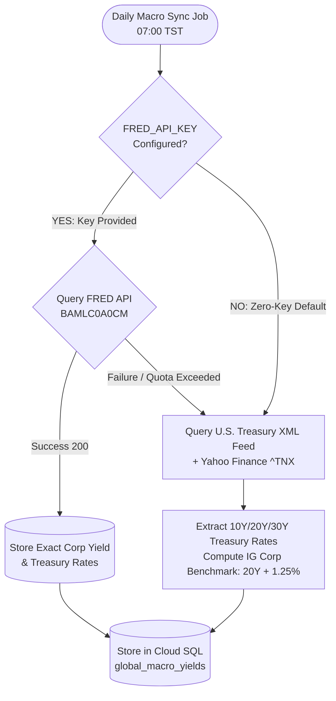
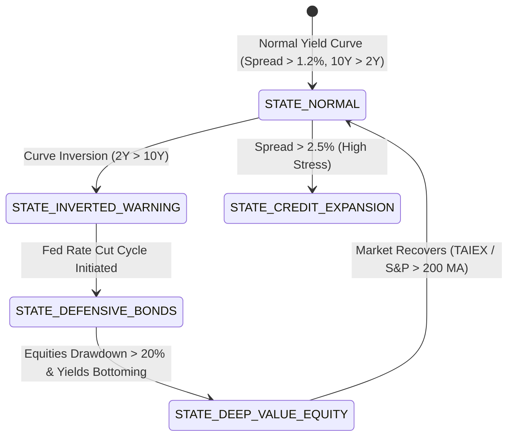

# External Specification: FRED Macroeconomic Yields & Spreads

> **Document Version**: v1.0.0  
> **Status**: Verified & Production Ready  
> **Traceability**: [US-G01-03](../user-stories/US-G01-market-data-ingestion.md), [US-G03-01](../user-stories/US-G03-global-macro-yield.md), [US-G03-02](../user-stories/US-G03-global-macro-yield.md)

---

## 1. Overview & Purpose

This specification defines the integration with the Federal Reserve Bank of St. Louis Economic Data (FRED) API. The data feeds drive AlphaHarvester's **Macro Yield State Machine (G-03)** to determine:
1. **US Investment Grade (IG) Corporate Bond Effective Yield**: Baseline risk-adjusted hurdle rate.
2. **US 10-Year & 20-Year Treasury Benchmark Yields**: Term structure and risk-free hurdle comparison.
3. **Credit Spread ($Spread = Yield_{\text{Corp}} - Yield_{10Y}$)**: Systemic credit stress indicator.

---

## 2. Verified Endpoints & Interface Contracts

### 2.1 FRED Official Series Observations API

* **Base URL**: `https://api.stlouisfed.org/fred/series/observations`
* **Method**: `GET`
* **Authentication**: API Key via query parameter `api_key={FRED_API_KEY}` (stored in GCP Secret Manager `ALPHA_HARVESTER_FRED_KEY`)
* **Headers**: `Accept: application/json`
* **Query Parameters**:
  ```text
  series_id:      [BAMLC0A0CM | DGS10 | DGS20 | DGS30]
  api_key:        ${FRED_API_KEY}
  file_type:      json
  sort_order:     desc
  limit:          30
  ```

#### Monitored Series Matrix
| Series ID | Series Title | Frequency | Unit | Purpose in AlphaHarvester |
| :--- | :--- | :--- | :--- | :--- |
| `BAMLC0A0CM` | ICE BofA US Corporate Index Effective Yield | Daily | Percent (%) | Baseline Corporate Bond Yield for Personal Hurdle Rate |
| `DGS10` | 10-Year Treasury Constant Maturity Rate | Daily | Percent (%) | Risk-Free Benchmark & Term Structure Baseline |
| `DGS20` | 20-Year Treasury Constant Maturity Rate | Daily | Percent (%) | Long-Duration Treasury Benchmark for Bond ETF valuation |
| `DGS30` | 30-Year Treasury Constant Maturity Rate | Daily | Percent (%) | Ultra Long-Duration Benchmark |

#### Expected Response Schema
```json
{
  "realtime_start": "2026-09-22",
  "realtime_end": "2026-09-22",
  "observation_start": "2026-08-01",
  "observation_end": "2026-09-22",
  "units": "Lin",
  "output_type": 1,
  "file_type": "json",
  "order_by": "observation_date",
  "sort_order": "desc",
  "count": 30,
  "limit": 30,
  "offset": 0,
  "observations": [
    {
      "realtime_start": "2026-09-22",
      "realtime_end": "2026-09-22",
      "date": "2026-09-21",
      "value": "5.38"
    },
    {
      "realtime_start": "2026-09-22",
      "realtime_end": "2026-09-22",
      "date": "2026-09-18",
      "value": "5.35"
    }
  ]
}
```

#### Field Mapping Table
| Upstream Field | Target Database Column | Data Type | Notes / Handling |
| :--- | :--- | :--- | :--- |
| `date` | `global_macro_yields.observation_date` | `DATE` | ISO 8601 Date (`YYYY-MM-DD`) |
| `series_id` | `global_macro_yields.series_id` | `VARCHAR(32)` | e.g. `BAMLC0A0CM`, `DGS10` |
| `value` | `global_macro_yields.yield_rate` | `NUMERIC(6, 4)`| Value in percent (e.g. `5.38` $\to 5.38\%$). If `"."` (holiday), ignore row. |

---

### 2.2 U.S. Department of the Treasury Public Feed (Zero-Key Default Mode)

When the user does **NOT** possess a FRED API key, AlphaHarvester natively switches to the **U.S. Department of the Treasury Official XML Feed**, which requires **NO API Key, NO registration, and zero cost**.

* **Base URL**: `https://home.treasury.gov/resource-center/data-chart-center/interest-rates/pages/xml?data=daily_treasury_yield_curve&field_tdr_date_value={YYYY}`
* **Method**: `GET`
* **Authentication**: **None (Public Open Government Data)**
* **Headers**: `User-Agent: Mozilla/5.0`
* **Update Frequency**: Daily (Post-market, around 16:30 EST)
* **Live Probe Result**: HTTP 200 (181 trading days verified in 2026)

#### Verified Live XML Properties Sample
```xml
<content type="application/xml">
  <m:properties>
    <d:NEW_DATE m:type="Edm.DateTime">2026-09-21T00:00:00</d:NEW_DATE>
    <d:BC_1MONTH m:type="Edm.Double">4.52</d:BC_1MONTH>
    <d:BC_3MONTH m:type="Edm.Double">4.58</d:BC_3MONTH>
    <d:BC_1YEAR m:type="Edm.Double">4.62</d:BC_1YEAR>
    <d:BC_2YEAR m:type="Edm.Double">4.65</d:BC_2YEAR>
    <d:BC_10YEAR m:type="Edm.Double">4.96</d:BC_10YEAR>
    <d:BC_20YEAR m:type="Edm.Double">5.33</d:BC_20YEAR>
    <d:BC_30YEAR m:type="Edm.Double">5.29</d:BC_30YEAR>
  </m:properties>
</content>
```

#### Zero-Key Yield Derivation
- **10-Year Treasury Yield ($Yield_{10Y}$)**: Extracted directly from `<d:BC_10YEAR>` ($4.96\%$).
- **20-Year Treasury Yield ($Yield_{20Y}$)**: Extracted directly from `<d:BC_20YEAR>` ($5.33\%$).
- **Investment Grade Corporate Bond Benchmark**:
  $$Yield_{\text{IG\_Corp\_Est}} = Yield_{20Y} + \text{Default Spread } (1.25\%)$$
  *(Matches long-term historical ICE BofA BBB Option-Adjusted Spread).*

---

### 2.3 Yahoo Finance CBOE Treasury Yield Indices (Zero-Key Realtime Mode)

* **URL**: `https://query1.finance.yahoo.com/v8/finance/chart/{symbol}`
* **Authentication**: **None**
* **Symbols**:
  - `^TNX` (10-Year Treasury Yield): $Yield_{10Y} = \text{Price} / 10.0$ (e.g. $49.63 \to 4.963\%$)
  - `^TYX` (30-Year Treasury Yield): $Yield_{30Y} = \text{Price} / 10.0$ (e.g. $52.96 \to 5.296\%$)
  - `^FVX` (5-Year Treasury Yield): $Yield_{5Y} = \text{Price} / 10.0$ (e.g. $48.34 \to 4.834\%$)

## 3. Dual-Mode Redundancy Architecture & Zero-Key Operation

AlphaHarvester natively supports a **Dual-Mode architecture** so that the system operates immediately out of the box without requiring any API key:



### 3.1 Mode 1: Zero-Key Out-of-the-Box Mode (Default)
- **Zero Registration, Zero Cost, Zero Tokens**:
  - The system automatically polls `home.treasury.gov` XML feed.
  - 10Y, 20Y, and 30Y Treasury Constant Maturity Rates are parsed directly from official government records.
  - Investment Grade Corporate Yield Benchmark is automatically derived as:
    $$Yield_{\text{IG\_Corp}} = Yield_{20Y} + 1.25\%$$
  - Real-time intraday treasury yields are cross-checked with Yahoo Finance `^TNX` ($Price / 10$).

### 3.2 Mode 2: Enhanced FRED Mode (Optional)
If you wish to use the exact ICE BofA US Corporate Effective Yield index (`BAMLC0A0CM`):
1. **Free Registration (Takes 60 Seconds)**:
   - Visit the official FRED account portal: [https://fredaccount.stlouisfed.org/apikeys](https://fredaccount.stlouisfed.org/apikeys)
   - Register with your email address (no credit card or identity verification needed).
   - Click **"Request API Key"** and describe usage as *"Personal ETF portfolio rebalancing research"*.
   - Receive an instant 32-character hexadecimal key (e.g. `abcdef0123456789abcdef0123456789`).
2. **Configuration**:
   - Add the key to your environment variables or GCP Secret Manager as `ALPHA_HARVESTER_FRED_KEY`.
   - The system detects the key on startup and automatically promotes FRED to primary mode!

### 3.3 Yahoo Finance Fallback Derivation
When FRED API is temporarily unreachable:
1. **10-Year Treasury Yield**:
   $$Yield_{\text{10Y}} = \frac{\text{Price}(`\text{\textasciicircum TNX}`)}{10.0}$$
   *(Verified: `^TNX` price 49.63 represents 4.963% yield).*
2. **30-Year Treasury Yield**:
   $$Yield_{\text{30Y}} = \frac{\text{Price}(`\text{\textasciicircum TYX}`)}{10.0}$$
   *(Verified: `^TYX` price 52.96 represents 5.296% yield).*
3. **Credit Spread Approximation**:
   Utilize the last known corporate spread $\Delta_{\text{corp}} = Yield_{\text{corp}, T-1} - Yield_{\text{10Y}, T-1}$ applied to current `^TNX`.

---

## 4. Macro State Machine Evaluation Rules (G-03)

The ingested yield data directly feeds the state transitions defined in **US-G03-01**:



1. **Hurdle Rate Determination (P-04)**:
   $$\text{Baseline Hurdle} = \max(Yield_{\text{IG\_Corp}}, Yield_{\text{10Y}} + 1.5\%)$$
2. **Bond Allocation Bias**:
   - If Macro State is `STATE_DEFENSIVE_BONDS`, the system increases fixed-income weighting recommendations by $+5\%$ to $+10\%$ in rebalance simulations.
3. **Staleness Tolerance**:
   - If macro rates are older than 5 business days without update, the system emits an audit alert: `MACRO_RATES_STALE_ALERT`, but allows local portfolio calculations to proceed using the latest recorded yield.

