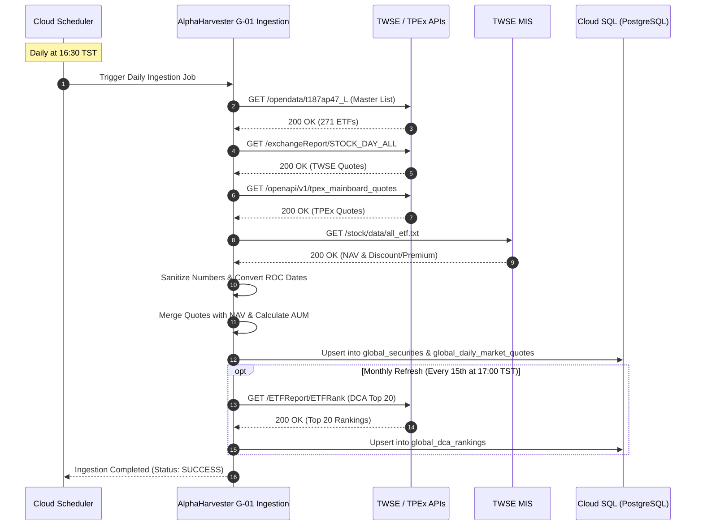

# External Specification: Taiwan Securities Market Data (TWSE & TPEx)

> **Document Version**: v1.0.0  
> **Status**: Verified & Production Ready  
> **Traceability**: [US-G01-01](../user-stories/US-G01-market-data-ingestion.md), [US-G01-02](../user-stories/US-G01-market-data-ingestion.md), [US-G01-04](../user-stories/US-G01-market-data-ingestion.md), [US-G02-01](../user-stories/US-G02-global-universe-ranking.md)

---

## 1. Overview & Purpose

This specification defines the integration interfaces for Taiwan Stock Exchange (TWSE, 臺灣證券交易所) and Taipei Exchange (TPEx, 證券櫃檯買賣中心). These endpoints provide:
1. **Complete ETF Master Universe & Listing Dates** (for $N \ge 30$ trading days Central Limit Theorem evaluation).
2. **Daily Trading Quotes** (Closing Price, Volume, Transaction Turnover).
3. **Net Asset Value (NAV) & Live Discount/Premium Rates** (for the $|\text{折溢價}| \le 0.5\%$ Core Fast-Track filter).
4. **Monthly Regular Quota (定期定額) Top 20 Rankings** (for Core Fast-Track recognition).

---

## 2. Verified Endpoints & Interface Contracts

### 2.1 TWSE ETF Master Universe & Metadata

* **Source**: TWSE Open Data API
* **URL**: `https://openapi.twse.com.tw/v1/opendata/t187ap47_L`
* **Method**: `GET`
* **Headers**: `Accept: application/json`, `User-Agent: Mozilla/5.0`
* **Update Frequency**: Daily (Post-market)
* **Live Probe Result**: HTTP 200 (271 active fund/ETF records verified)

#### Response Schema (Key Fields)
```json
[
  {
    "出表日期": "1150921",
    "基金代號": "0050",
    "基金簡稱": "元大台灣50",
    "基金類型": "國內成分證券指數股票型基金(股票)",
    "基金中文名稱": "元大台灣卓越50證券投資信託基金",
    "基金英文名稱": "Yuanta/P-shares Taiwan Top 50 ETF",
    "標的指數/追蹤指數名稱": "臺灣50指數",
    "成立日期": "0920625",
    "上市日期": "0920630",
    "發行單位數/轉換數": "2205100000",
    "保管機構": "中國信託商業銀行股份有限公司"
  }
]
```

#### Field Mapping Table
| Upstream Field | Target Database Column | Data Type | Transformation / Parsing Rule |
| :--- | :--- | :--- | :--- |
| `基金代號` | `global_securities.symbol` | `VARCHAR(16)` | Primary Key / Symbol Code (e.g. `0050`, `006208`) |
| `基金簡稱` | `global_securities.short_name` | `VARCHAR(64)` | UTF-8 String |
| `基金中文名稱` | `global_securities.full_name` | `VARCHAR(255)` | UTF-8 String |
| `基金類型` | `global_securities.fund_type` | `VARCHAR(64)` | Classification (Equity, Bond, Active, Commodity) |
| `標的指數/追蹤指數名稱` | `global_securities.benchmark_index`| `VARCHAR(128)`| Tracked benchmark name |
| `上市日期` | `global_securities.listing_date` | `DATE` | ROC Year Conversion (`0920630` $\to$ `2003-06-30`, `1150409` $\to$ `2026-04-09`) |
| `成立日期` | `global_securities.inception_date`| `DATE` | ROC Year Conversion (`0920625` $\to$ `2003-06-25`) |
| `發行單位數/轉換數` | `global_securities.shares_outstanding`| `BIGINT` | Clean numeric string (remove commas, cast to integer) |

---

### 2.2 TWSE Daily Market Quotes (Concentrated Market)

* **Source**: TWSE Open Data API
* **URL**: `https://openapi.twse.com.tw/v1/exchangeReport/STOCK_DAY_ALL`
* **Method**: `GET`
* **Headers**: `Accept: application/json`
* **Update Frequency**: Daily at 16:00 TST (Trading Days)
* **Live Probe Result**: HTTP 200 (1,380 securities, 240+ TWSE ETFs verified)

#### Response Schema (Sample Row)
```json
[
  {
    "Code": "0050",
    "Name": "元大台灣50",
    "TradeVolume": "12891394",
    "TradeValue": "1441852930",
    "OpeningPrice": "111.50",
    "HighestPrice": "112.00",
    "LowestPrice": "111.20",
    "ClosingPrice": "111.85",
    "Change": "0.50",
    "Transaction": "14280"
  }
]
```

#### Field Mapping Table
| Upstream Field | Target Database Column | Data Type | Transformation / Parsing Rule |
| :--- | :--- | :--- | :--- |
| `Code` | `symbol` | `VARCHAR(16)` | Foreign Key to `global_securities.symbol` |
| `ClosingPrice` | `close_price` | `NUMERIC(12, 4)` | Convert string to numeric; if `"--"`, set `NULL` |
| `OpeningPrice` | `open_price` | `NUMERIC(12, 4)` | Convert string to numeric; if `"--"`, set `NULL` |
| `HighestPrice` | `high_price` | `NUMERIC(12, 4)` | Convert string to numeric; if `"--"`, set `NULL` |
| `LowestPrice` | `low_price` | `NUMERIC(12, 4)` | Convert string to numeric; if `"--"`, set `NULL` |
| `TradeVolume` | `volume_shares` | `BIGINT` | Total trade volume in shares |
| `TradeValue` | `turnover_amount` | `NUMERIC(16, 2)`| Total trade value in TWD |
| `Transaction` | `transaction_count` | `INTEGER` | Number of transactions |

---

### 2.3 TPEx Daily Market Quotes (OTC Market - Bond ETFs & OTC Equity ETFs)

* **Source**: TPEx Open Data API
* **URL**: `https://www.tpex.org.tw/openapi/v1/tpex_mainboard_quotes`
* **Method**: `GET`
* **Headers**: `Accept: application/json`
* **Update Frequency**: Daily at 16:15 TST (Trading Days)
* **Live Probe Result**: HTTP 200 (1,017 securities, 118 TPEx ETFs verified, e.g. `00679B`, `00720B`)

#### Response Schema (Sample Row)
```json
[
  {
    "Date": "1150922",
    "SecuritiesCompanyCode": "00679B",
    "CompanyName": "元大美債20年",
    "Close": "25.58",
    "Change": "-0.06",
    "Open": "25.61",
    "High": "25.62",
    "Low": "25.57",
    "TradingShares": "9786000",
    "TransactionAmount": "250505030",
    "TransactionNumber": "1545",
    "Capitals": "6180192000"
  }
]
```

#### Field Mapping Table
| Upstream Field | Target Database Column | Data Type | Transformation / Parsing Rule |
| :--- | :--- | :--- | :--- |
| `SecuritiesCompanyCode` | `symbol` | `VARCHAR(16)` | Foreign Key to `global_securities.symbol` |
| `Date` | `trade_date` | `DATE` | ROC Year Conversion (`1150922` $\to$ `2026-09-22`) |
| `Close` | `close_price` | `NUMERIC(12, 4)` | Convert string to numeric; if `"--"`, set `NULL` |
| `TradingShares` | `volume_shares` | `BIGINT` | Total trade volume in shares |
| `TransactionAmount` | `turnover_amount` | `NUMERIC(16, 2)`| Total trade value in TWD |
| `Capitals` | `shares_outstanding` | `BIGINT` | Total outstanding units |

---

### 2.4 TWSE MIS Real-time Net Asset Value (NAV) & Discount/Premium Rates

* **Source**: TWSE Market Information System (MIS)
* **URL**: `https://mis.twse.com.tw/stock/data/all_etf.txt`
* **Method**: `GET`
* **Headers**: `Accept: application/json`, `User-Agent: Mozilla/5.0`
* **Update Frequency**: Real-time during trading hours, Final snapshot at 17:05 TST
* **Live Probe Result**: HTTP 200 (358 active TWSE + TPEx ETFs verified)

#### Response Schema (JSON format inside `a1[].msgArray`)
```json
{
  "a1": [
    {
      "msgArray": [
        {
          "a": "006208",
          "b": "富邦台50",
          "c": "1,860,540,000",
          "d": "0",
          "e": "255.70",
          "f": "255.90",
          "g": "-0.08",
          "h": "255.65",
          "i": "20260922",
          "j": "17:05:00",
          "k": "1"
        }
      ]
    }
  ]
}
```

#### Field Mapping & Calculation Table
| Key | Meaning | Target Database Column | Data Type | Formula / Transformation |
| :--- | :--- | :--- | :--- | :--- |
| `a` | ETF Symbol | `symbol` | `VARCHAR(16)` | Matches `0050`, `006208` |
| `b` | ETF Name | - | `VARCHAR(64)` | Descriptive name |
| `c` | Shares Outstanding | `shares_outstanding` | `BIGINT` | Strip commas, cast to integer |
| `e` | Market Close/Last Price | `close_price` | `NUMERIC(12, 4)` | Cast to numeric |
| `f` | Estimated / Final NAV | `nav` | `NUMERIC(12, 4)` | Cast to numeric |
| `g` | Discount/Premium Rate (%) | `discount_premium_pct` | `NUMERIC(6, 4)` | Cast to numeric (e.g. `-0.08` means `-0.08%`) |
| `h` | Previous Day NAV | `prev_nav` | `NUMERIC(12, 4)` | Cast to numeric |
| `i` | Snapshot Date | `trade_date` | `DATE` | ISO 8601 Date (`YYYYMMDD` $\to$ `YYYY-MM-DD`) |
| Calculated | **Fund AUM (資產規模)** | `aum_amount` | `NUMERIC(18, 2)` | $\text{AUM} = \text{shares\_outstanding (c)} \times \text{NAV (f)}$ |

---

### 2.5 TWSE Regular Quota (定期定額) Top 20 Rankings

* **Source**: TWSE Open Data API
* **URL**: `https://openapi.twse.com.tw/v1/ETFReport/ETFRank`
* **Method**: `GET`
* **Headers**: `Accept: application/json`
* **Update Frequency**: Monthly (Published on the 15th of each month, or first business day after)
* **Live Probe Result**: HTTP 200 (20 records verified)

#### Response Schema (Sample Row)
```json
[
  {
    "No": "1",
    "STOCKsSecurityCode": "2330",
    "STOCKsName": "台積電",
    "STOCKsNumberofTradingAccounts": "231711",
    "ETFsSecurityCode": "0050",
    "ETFsName": "元大台灣50",
    "ETFsNumberofTradingAccounts": "1280028"
  },
  {
    "No": "2",
    "STOCKsSecurityCode": "2317",
    "STOCKsName": "鴻海",
    "STOCKsNumberofTradingAccounts": "89500",
    "ETFsSecurityCode": "006208",
    "ETFsName": "富邦台50",
    "ETFsNumberofTradingAccounts": "542310"
  }
]
```

#### Field Mapping Table
| Upstream Field | Target Database Column | Data Type | Usage in Core Fast-Track |
| :--- | :--- | :--- | :--- |
| `No` | `rank` | `INTEGER` | Ranking order (1 through 20) |
| `ETFsSecurityCode` | `symbol` | `VARCHAR(16)` | If symbol is present in this list $\to$ satisfies DCA Top 20 criterion |
| `ETFsName` | `etf_name` | `VARCHAR(64)` | ETF name |
| `ETFsNumberofTradingAccounts`| `active_dca_accounts` | `INTEGER` | Active monthly regular quota investor accounts |

---

## 3. Data Transformation & Ingestion Logic

### 3.1 ROC Date Conversion Algorithm
Upstream Taiwan APIs return dates as either 7 digits (`1150922`) or 6 digits (`920630`).
```python
def parse_roc_date(roc_str: str) -> str:
    """
    Converts ROC date string (e.g. '1150922' or '0920630') to ISO 'YYYY-MM-DD'.
    """
    roc_str = str(roc_str).strip().replace("/", "").replace("-", "")
    if len(roc_str) == 7:
        roc_year = int(roc_str[:3])
        month = roc_str[3:5]
        day = roc_str[5:7]
    elif len(roc_str) == 6:
        roc_year = int(roc_str[:2])
        month = roc_str[2:4]
        day = roc_str[4:6]
    else:
        raise ValueError(f"Invalid ROC date format: {roc_str}")
    
    gregorian_year = roc_year + 1911
    return f"{gregorian_year:04d}-{month}-{day}"
```

### 3.2 Ingestion Schedule & Orchestration



---

## 4. Gatekeeper Validation & Failure Policy

In compliance with **US-G01-05**:
1. **Minimum Securities Threshold**:
   - `STOCK_DAY_ALL` must return $\ge 1,000$ securities and $\ge 200$ ETFs.
   - `all_etf.txt` must return $\ge 300$ ETFs.
   - If records are below these thresholds, ingestion is aborted with `DATA_INCOMPLETE_HALT`.
2. **Critical Core Securities Probe**:
   - Quotes for `0050` and `006208` must exist and contain non-null `close_price > 0`.
   - If missing, failover to Yahoo Finance Chart API (`0050.TW`, `006208.TW`).
3. **Retry & Backoff**:
   - Maximum 3 retries with exponential backoff (5s, 15s, 45s).
   - If all retries fail, alert operator and log critical event to Cloud Logging.

