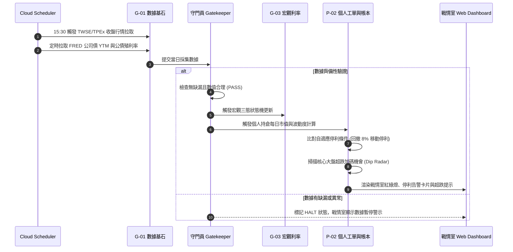
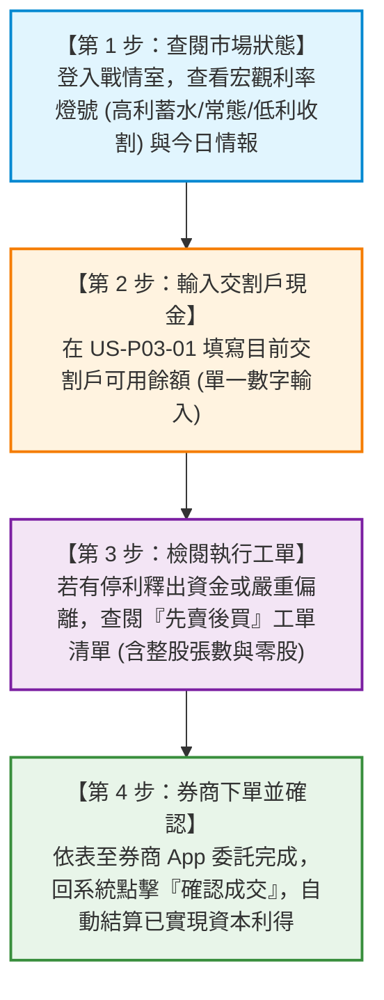

# AlphaHarvester 使用者故事總索引與雙層架構追溯矩陣 (Master Index & Traceability)

**專案名稱**：AlphaHarvester 跨週期自適應投資決策與資產再平衡系統  
**架構規範**：雙層領域驅動架構 (Two-Tier Domain Architecture: Global vs Personal)  
**雲端環境**：Google Cloud Platform (GCP Cloud Run + Google Cloud IAP)  
**文件版本**：v3.0.0 (APPROVED)  

---

## 1. 雙層架構全景模組清單

本系統需求嚴格依據算力生命週期與隱私隔離邊界劃分為**三大系統全域模組**與**四大個人投組模組**（共計 26 條標準 User Stories）：

```text
docs/01-requirements/user-stories/
├── README.md                           # 本總索引與追溯矩陣文件
│
├── 【第一層：系統全域層 (Global Services - 客觀市場與公用算力)】
│   ├── US-G01-market-data-ingestion.md     # G-01：市場數據與情報基石 (5 條 US)
│   ├── US-G02-global-universe-ranking.md   # G-02：全域標的治理與多因子排名 (2 條 US)
│   └── US-G03-global-macro-yield.md        # G-03：宏觀利率環境狀態機 (2 條 US)
│
└── 【第二層：個人投組層 (Personal Services - 隔離帳本與個人決策)】
    ├── US-P01-personal-capacity-sizing.md  # P-01：個人資本容量與標的治理 (3 條 US)
    ├── US-P02-personal-ledger-and-orders.md# P-02：個人庫存、扣款排程、校正與工單 (8 條 US)
    ├── US-P03-personal-cash-and-dividends.md# P-03：個人現金水位、扣款預告與配息 (3 條 US)
    └── US-P04-personal-hurdle-and-ledger.md# P-04：個人月度對帳 (取代 Excel)、退休導航與歸因 (5 條 US)
```

---

## 2. 系統角色與參與者矩陣 (System Actors)

| 參與者 | 角色代碼 | 權限範圍與職責 |
| --- | --- | --- |
| **投資人 (小白使用者)** | `Investor` | 系統主要操作者。登入 Web 戰情室，查看宏觀狀態、停利告警、超跌雷達，輸入現金水位、微調成交股數並手動確認工單。 |
| **系統排程器** | `System Scheduler` | 雲端定時服務 (Cloud Scheduler)。每日盤後觸發數據拉取、每半年觸發多因子全市場排名。 |
| **數據齊備性守門員** | `Gatekeeper` | 資料驗證器。在所有量化計算前檢查數據完整性，異常時自動熔斷暫停。 |
| **宏觀利率感知大腦** | `Macro Engine` | 依據 FRED 最新公司債 YTM 自動維持三態利率狀態機，發布全域股債基準配比。 |
| **工單求解器** | `Gap Solver Engine` | 個人投組計算核心。負責先賣後買工單計算、整零股拆解與資金守恆防呆。 |
| **雲端身分邊界** | `Google Cloud IAP` | 安全防護網關。攔截外網請求，驗證 Google 登入並注入 `X-Goog-Authenticated-User-Email`。 |

---

## 3. 使用者日常與週期工作流時序 (Operational Workflows)

### 3.1 每日自動化巡檢流（盤後背景自動完成）


### 3.2 每月小白極簡四步決策流


### 3.3 半年度客觀審核與換倉流 (每年 6/30, 12/31)
1. **G-02 全域評分**：系統排程對全市場標的執行 TER、AUM、流動性硬約束過濾，計算 MOM、Sharpe、Hurst、定額排行多因子總分並排名。
2. **P-01 個人映射**：依個人月投入金 $C_{\text{monthly}}$ 求解專屬檔數 $N_{\text{sat}}$，套用 1.4N 緩衝區比對個人當前持倉。
3. **換倉指引**：在緩衝區內標的保留續留，跌出緩衝區標的自動標註為 `ORPHAN`，暫停定額扣款並列入出清。

---

## 4. 需求全生命週期追溯矩陣 (Traceability Matrix)

| PRD 章節 | 領域模組 | User Story 編號 | 使用者故事摘要 | 關鍵驗收指標 |
| --- | --- | --- | --- | --- |
| **PRD 3.1** | G-01 數據基石 | **US-G01-01** | 台股 ETF 與五大基準指數日行情採集 | 每日 15:30 採集 ETF 與 ^TWII, ^GSPC, ^NDX, ^SOX, ^N225 |
| **PRD 3.1** | G-01 數據基石 | **US-G01-02** | FRED 宏觀利率定時採集 | 每日美東收盤拉取 US IG Corp YTM 與公債殖利率 |
| **PRD 3.1** | G-01 數據基石 | **US-G01-03** | 證交所定期定額熱門排行採集 | 每月 15 日前採集 Top 20 ETF 戶數與排行 |
| **PRD 3.1** | G-01 數據基石 | **US-G01-04** | 新上市 ETF 基本面與除息日程採集 | 掛牌滿 30 交易日自動納入監測，免獨立 Table |
| **PRD 3.1** | G-01 數據基石 | **US-G01-05** | 數據齊備性守門員驗證 | 缺收盤價或異常跳空時自動熔斷暫停 |
| **PRD 3.2** | G-02 標的治理 | **US-G02-01** | 三大資產層級硬約束與快速通道 | 核心大盤 30 交易日快速通道、衛星滿 60 日 |
| **PRD 3.2** | G-02 標的治理 | **US-G02-02** | 多因子客觀評分與總排名 | 每月 15 日感知刷新，6/30 與 12/31 決策換倉 |
| **PRD 3.3** | G-03 宏觀利率 | **US-G03-01** | 三態利率狀態機自動判定 | 5.0% 蓄水期 / 4.0~5.0% 常態 / 3.5% 收割期 |
| **PRD 3.3** | G-03 宏觀利率 | **US-G03-02** | 股債基準矩陣與黑天鵝救災 | 80/20 等配比矩陣、-20% DCA 加碼、-30% 債券變現 |
| **PRD 4.1** | P-01 個人容量 | **US-P01-01** | 個人資本規模自適應檔數求解 | 依 $C_{\text{monthly}}$ 動態解出 $N_{\text{core}} \in [2,7]$, $N_{\text{sat}} \in [0,16]$ |
| **PRD 4.1** | P-01 個人容量 | **US-P01-02** | 1.4N 個人持倉安全緩衝換倉判定 | $1 \sim 1.4N$ 安全續留，$> 1.4N$ 觸發淘汰 |
| **PRD 4.1** | P-01 個人容量 | **US-P01-03** | 個人 ORPHAN 孤兒標的處置 | 標記孤兒狀態、暫停續扣、排定出清 |
| **PRD 4.2** | P-02 個人庫存 | **US-P02-01** | 極簡持倉帳本模型 | 僅保留代碼、股數、加權成本、市值 |
| **PRD 4.2** | P-02 個人庫存 | **US-P02-02** | 雙軌庫存與扣款快速校正機制 | 扣款 5 秒微調確認 + 隨時手動覆寫券商真實股數 |
| **PRD 4.2** | P-02 個人庫存 | **US-P02-03** | 每日盤後自適應停利收割告警 | 滾動波動度門檻 + 自高點回撤 8% 戰情室亮燈 |
| **PRD 4.2** | P-02 個人庫存 | **US-P02-04** | 逢低超跌加碼雷達 | 200 EMA 負乖離或回撤達標時主動提供加碼試算 |
| **PRD 4.2** | P-02 個人庫存 | **US-P02-05** | 標的獨立定期定額扣款排程設定 | 支援 6, 16, 26 號與金額自訂、啟用/暫停 |
| **PRD 4.2** | P-02 個人庫存 | **US-P02-06** | 解耦定額與低頻再平衡工單 | 平日不改定額；停利現金額達 MEAT 產出工單 |
| **PRD 4.2** | P-02 個人庫存 | **US-P02-07** | 已實現資本利得記錄 | 賣出成交結算價差淨利，扣證交稅 0.1% 與手續費 |
| **PRD 4.2** | P-02 個人庫存 | **US-P02-08** | 三大極簡 What-If 壓力沙盤推演 | 虛擬試算大盤-10%、崩跌-30%、急降息 100bps |
| **PRD 4.3** | P-03 個人現金 | **US-P03-01** | 單一可用現金水位極簡校準輸入 | 每月小白僅需輸入交割戶餘額一個數字 |
| **PRD 4.3** | P-03 個人現金 | **US-P03-02** | 本月扣款排程與交割資金預告日曆 | 投影未來 30 天扣款資金需求，預防違約交割 |
| **PRD 4.3** | P-03 個人現金 | **US-P03-03** | 已實現配息所得自動入帳 | 除息發放日自動結算入帳，標註 76W 海外所得 |
| **PRD 4.4** | P-04 導航歸因 | **US-P04-01** | 月度資產對帳月報 (取代 Excel) | 總資產快照、MoM 月增減 (新儲蓄/利得/股息拆解) |
| **PRD 4.4** | P-04 導航歸因 | **US-P04-02** | 退休 Hurdle Rate 與財富漏斗錐 | 數值求解最低實質報酬率、蒙地卡羅 $P_{10} \sim P_{90}$ 狀態機 |
| **PRD 4.4** | P-04 導航歸因 | **US-P04-03** | 雙重報酬度量與三源歸因 | Unitized TWR vs MWR、量化夏農超額 Alpha |
| **PRD 5.1** | P-04 導航歸因 | **US-P04-04** | Cloud Run 部屬與 Cloud IAP 整合 | 讀取 `X-Goog-Authenticated-User-Email` 隔離租戶 |
| **PRD 5.2** | P-04 導航歸因 | **US-P04-05** | 全域戰情室 Web 介面整合 | 一頁式現代化 Dashboard，零外部檔案匯出 |

